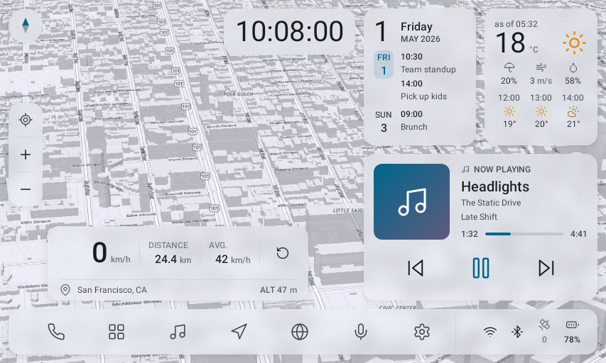
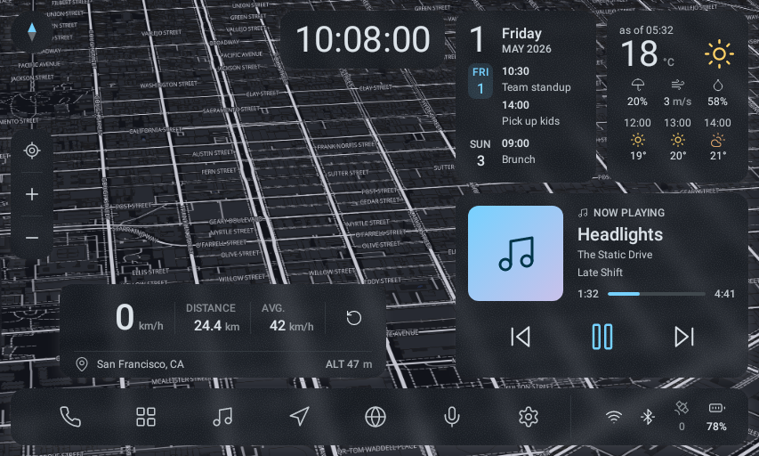

<div align="center">


# Femto Car Launcher

**A glanceable Android home launcher for in-car displays.**

[](https://github.com/seijikohara/femto-car-launcher/actions/workflows/ci.yml)
[](https://github.com/seijikohara/femto-car-launcher/releases/latest)
[](https://github.com/seijikohara/femto-car-launcher/releases/tag/nightly)
[-3DDC84?logo=android&logoColor=white)](https://developer.android.com/about/versions/13)

</div>

Femto Car Launcher replaces the Android home screen with a single
fixed dashboard designed for automotive viewing distances and touch
accuracy. The dashboard combines a live map, driving data, weather,
calendar, and media control on one screen, so a driver reads the
essentials at a glance instead of navigating between apps.

Femto Car Launcher targets three hardware classes: aftermarket
CarPlay / Android Auto AI boxes that inject Android into a factory
display, built-in Android head units, and smartphones mounted as a
car-navigation display. On a smartphone the launcher also runs as a
regular app; becoming the default home screen stays optional. The
minimum supported platform is Android 13 (Application Programming
Interface — API — level 33). No single market is privileged: language,
units, and locale-specific behaviour adapt per device.

The [project site](https://seijikohara.github.io/femto-car-launcher/)
describes every feature in depth, carries the install guide, and
hosts a screenshot catalog of the dashboard across display sizes and
settings.

<div align="center">





<sub>The dashboard on a head-unit display, light and dark. The map style follows
the theme. These images are the project's own
screenshot-test references, regenerated from the current code on every UI
change, so they cannot drift from the build. The map behind the interface is a
still capture of this app's OpenStreetMap backend — the map itself renders in a
WebView, which the screenshot harness cannot run (see
<a href="app/src/test/resources/README.md">app/src/test/resources</a>).</sub>

</div>

## Live map

The dashboard background is a full-bleed live map that follows the
vehicle.

- **Two map providers.** OpenStreetMap data rendered through the
  keyless OpenFreeMap service works out of the box with no account and
  no API key. A Google Maps provider (roadmap, satellite, hybrid, and
  terrain map types with a traffic overlay) activates when the user
  enters a personal Google Maps Platform API key in Settings → Map.
  Usage of the paid provider bills the key owner's own account; Femto
  Car Launcher adds no fees. The Google Maps provider is not offered in
  the territories on Google's
  [Prohibited Territories](https://cloud.google.com/maps-platform/terms/maps-prohibited-territories)
  list; see [TERMS.md](TERMS.md). The default OpenStreetMap provider is
  unaffected.
- **Bring your own style.** The OpenStreetMap provider can load any hosted
  MapLibre style you name (Settings → Appearance → Map color → Custom style
  URL), including one from a provider whose key rides in the URL. The map
  then shows that style's own credits. For a mirror of the default provider's
  layout there is separately a tile-host override under Settings → Map.
- **A car-navigation camera.** The camera follows the Global
  Positioning System (GPS) position with smooth easing, keeps the
  travel direction pointing up (heading-up), and offers a north-up
  mode. A drag detaches the camera for free panning; the camera
  re-attaches automatically after a pause, or immediately via the
  locate button. Zoom buttons and a compass sit at the screen edge in
  reach of the driver.
- **Depth and style.** Optional three-dimensional buildings and
  terrain relief add depth on the OpenStreetMap provider. Map colours
  can follow the launcher accent and the light/dark theme, or use the
  provider's own styles.
- **Self-healing.** A map that fails to load — an unstable link, a
  provider outage, a missing key — shows a clear notice in the visible
  map area and recovers automatically: reloads retry with a capped
  backoff while the network reports connectivity, and a reconnect after
  an offline period reloads the map without user action.

## Driving data and trips

- **Speed overlay.** Current speed, trip distance, average speed,
  altitude, and the reverse-geocoded address of the current position,
  rendered in high-contrast numerals. A tap on the reset button starts
  a new trip with a "Since" timestamp.
- **Trip recording.** An on-device track log records the route at one
  fix per second while driving, with a configurable retention period.
  Recorded trips export as GPS Exchange Format (GPX) files through the
  system file picker.
- **Trip flythrough.** A tap on the speed panel opens a
  three-dimensional wireframe replay of the recorded track — a
  flythrough with a speed-coloured trail and altitude curtain, rendered
  natively for smooth motion, with a two-dimensional fallback on
  devices without the required graphics support.

## Glanceable panels

- **Weather.** Current conditions, feels-like temperature, wind, and
  humidity from the Norwegian Meteorological Institute (MET Norway),
  with an hourly strip on the card and a full-screen panel built around
  a 24-hour temperature curve, precipitation nowcast, and daily range
  bars. Forecasts stay readable offline through an on-device cache.
- **Calendar.** A multi-day strip plus upcoming events read from the
  device calendar, with per-calendar visibility selection and a
  full-screen agenda panel. Event colours match the calendar colours.
- **Now playing.** The active media session of any music app: title,
  artist, album, cover art, and transport controls, including shuffle
  and repeat where the source app supports them. Cover art opens a
  full-screen player. Long titles scroll only while the vehicle is
  parked and truncate while moving. A spectrum visualisation renders on
  devices whose audio stack supports capture.
- **Clock.** A self-updating clock honouring the system 12/24-hour
  preference, with optional seconds.
- **Status cluster.** Wi-Fi and cellular signal, Bluetooth state, GPS
  reception, and battery level with charging state.

## Apps and voice

- **Dock.** An application dock attaches to any screen edge. A
  long-press edits the dock: buttons and status icons reorder or hide
  individually, and a reset restores the default layout.
- **App panel.** A full-screen application panel offers search, a
  pinned-apps row, recently used apps, an A–Z fast-scroll index, and
  three icon-size presets. A long-press on an app opens App info or
  uninstalls the app.
- **Voice assistant.** A microphone button captures speech in-launcher
  with a live transcript, and falls back to the system voice assistant
  when no on-device recognizer exists or the microphone permission is
  denied.

## Made for the car — and adjustable

Automotive defaults keep the dashboard legible and operable while
driving: at the default display size, body text stays at or above
16 sp and touch targets stay at or above 64 dp, and the layout
anchors cards clear of the driver's view with a left- and
right-hand-drive switch. Every default remains a user choice rather
than a lockout:

- **Layout.** Any orientation and aspect ratio, from wide head units to
  portrait phone mounts; the dashboard reflows across a matrix of screen
  sizes. Display size offers five steps from small to large, and the
  small end deliberately trades the automotive floors for density.
- **Appearance.** Material You dynamic colour by default, fixed accent
  presets as an alternative, light / dark / automatic theme, and a
  configurable glass look (blur, borders, drop shadows) for the
  floating cards.
- **Typography.** The system font by default, any Google Fonts family
  per slot (a Latin face plus a Chinese-Japanese-Korean fallback face)
  downloaded on demand, or any font already installed on the device —
  plus user-adjustable text size, weight, and letter spacing. No fonts
  ship inside the APK and no Play Services are required.
- **Motion.** A reduced-motion setting calms animations across the
  dashboard.
- **Panels.** Calendar, weather, and music cards toggle individually;
  the music card's spectrum, album name, and cover art each have a
  visibility switch.
- **Units.** Speed and temperature units and the clock format follow
  the user, independent of the system locale.

Every panel degrades gracefully: a denied permission or an unavailable
data source renders a reduced state instead of an error screen. The
dashboard renders identically regardless of vehicle motion —
distraction responsibility stays with the driver and the vehicle's own
instruments.

## Privacy and data

- Femto Car Launcher requires no account and contains no advertising
  and no analytics.
- Calendar and media data stay on the device; location leaves it only
  inside the requests to the services the user selects: map tiles from
  the chosen map provider, weather from MET Norway, and — only when the
  user configures a self-hosted geocoding host — reverse-geocoding
  queries; the default reverse geocoder runs on-device.
- Google Maps keys are entered by the user, are sent only to Google, and
  stay on the device apart from the user's own Android settings backup and
  device transfer — see [PRIVACY.md](PRIVACY.md).
- Notification access, when granted, is used solely to read and control
  the active media session for the now-playing card.
- An in-app diagnostics report (Settings → System) summarises device
  and runtime facts for troubleshooting, and the open-source licenses
  screen lists every bundled third-party component.
- The app's own terms are in [TERMS.md](TERMS.md), reachable in-app from
  Settings → System → Terms.

## Installation

Femto Car Launcher publishes two channels as release-signed APKs,
both built from this repository by continuous integration:

- **Stable** — a dated release that only changes when a build is
  judged ready, published as a
  [GitHub release](https://github.com/seijikohara/femto-car-launcher/releases/latest).
  Download `femto-car-launcher-v<version>.apk` from the latest
  release.
- **Nightly** — the newest test build, which changes often and may
  break, published as a rolling
  [`nightly`](https://github.com/seijikohara/femto-car-launcher/releases/tag/nightly)
  prerelease that replaces itself on every push that changes the APK.
  Download `femto-car-launcher-nightly.apk`. Its launcher icon carries
  an "N" badge and its app name reads "Femto Nightly", so it never
  gets mixed up with stable.

The two channels use different application ids and install side by
side, so trying a nightly build never means uninstalling stable, and
switching back is just as easy. Install either APK by sideloading on
the head unit or with `adb install -r <file>.apk`. Play Store
publication is not planned at present; sideloading is the supported
installation path. Android 13 or later is required.

To enable the optional paid map provider in Settings → Map:

- **Google Maps** — enter a personal Google Maps Platform API key with
  the Maps JavaScript API enabled and an HTTP-referrer restriction
  allowing `https://appassets.androidplatform.net/*`. An optional Map
  ID (created in the Google Cloud console) renders a vector map with
  heading-up rotation, tilt, and 3D; a blank Map ID renders a flat
  north-up raster map.

## Building from source

A Java Development Kit (JDK) 21 and an Android 13+ device or emulator
are the only prerequisites; the Gradle build provisions Node.js and
pnpm on demand for the bundled map page.

```bash
./gradlew assembleStableDebug   # debug APK at app/build/outputs/apk/stable/debug/
./gradlew test lint             # unit tests and Android Lint
```

[`CONTRIBUTING.md`](CONTRIBUTING.md) explains how to report bugs,
propose features, and submit changes; the coding rules and
verification commands live in [`AGENTS.md`](AGENTS.md) and
`.claude/rules/`.

## License

Femto Car Launcher is licensed under the Apache License, Version 2.0
([`LICENSE`](LICENSE)). Bundled third-party components keep their own
licenses, listed in-app under Settings → System → Open source
licenses.
