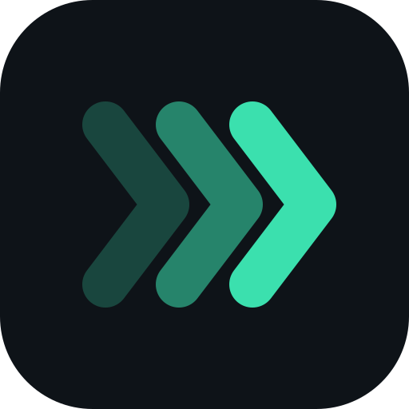
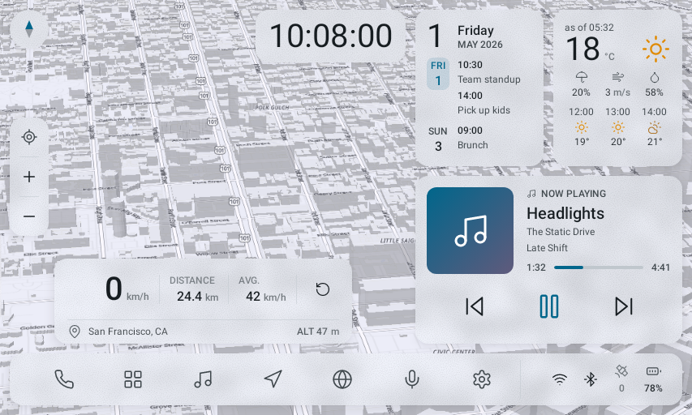
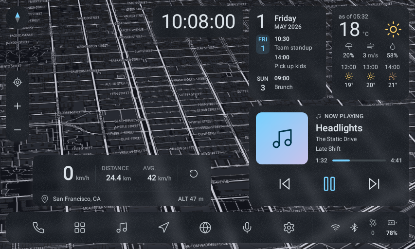

<div align="center">



# Femto Car Launcher

**A glanceable Android home launcher for in-car displays.**

[](https://github.com/seijikohara/femto-car-launcher/actions/workflows/ci.yml) [](https://github.com/seijikohara/femto-car-launcher/releases/latest) [](https://github.com/seijikohara/femto-car-launcher/releases/tag/nightly) [-3DDC84?logo=android&logoColor=white)](https://developer.android.com/about/versions/13)

</div>

Femto Car Launcher replaces the Android home screen with a single fixed dashboard designed for automotive viewing distances and touch accuracy. The dashboard combines a live map, driving data, weather, calendar, and media control on one screen, so you read the essentials at a glance instead of switching between apps.

Femto Car Launcher targets three hardware classes: aftermarket CarPlay / Android Auto AI boxes that inject Android into a factory display, Android head units (aftermarket units installed in the dashboard), and car-mounted phones. On a phone the launcher also runs as a regular app; making it the default home screen stays optional. The minimum supported platform is Android 13, which is Application Programming Interface (API) level 33. No single market is privileged: language, units, and locale-specific behavior adapt per device.

The [project site](https://seijikohara.github.io/femto-car-launcher/) describes each feature, carries the install guide, and hosts a screenshot catalog of the dashboard across display geometries, display sizes, themes, driver sides, and dock positions.

<div align="center">





<sub>The dashboard on a head-unit display, light and dark. The map style follows the theme. These images are the project's own screenshot-test references. Continuous integration compares them with the current code on every pull request, so a mismatch blocks the merge. The map behind the interface is a still capture of the OpenStreetMap provider: the live map renders in a WebView, which the screenshot harness cannot run (see <a href="app/src/test/resources/README.md">app/src/test/resources</a>).</sub>

</div>

## Live map

The dashboard background is a live map that fills the whole display and follows the vehicle.

- **Two map providers.** OpenStreetMap data rendered through the keyless OpenFreeMap service works without an account or an API key. A Google Maps provider (roadmap, satellite, hybrid, and terrain map types with a traffic overlay) activates when you enter a personal Google Maps Platform API key in **Settings → Map**. Usage of this paid provider bills your own Google Cloud account; Femto Car Launcher adds no fees. The Google Maps provider is not offered in the territories on Google's [Prohibited Territories](https://cloud.google.com/maps-platform/terms/maps-prohibited-territories) list; see the [Terms of Service](TERMS.md). The default OpenStreetMap provider is unaffected.
- **Bring your own style.** The OpenStreetMap provider can load a hosted MapLibre style you name (**Settings → Appearance → Map color → Custom style URL**), including a style whose provider key is part of the URL. The map then shows that style's own credits. To use a mirror of the default provider's tile layout instead, set **Settings → Map → Tile host (advanced)**.
- **A car-navigation camera.** The camera follows the Global Positioning System (GPS) position with easing and keeps the direction of travel pointing up (heading-up). A tap on the compass toggles a north-up mode. A drag detaches the camera for free panning. The camera re-attaches automatically after a pause, or immediately when you tap the locate button. Zoom buttons and a compass sit at the screen edge, within reach of the driver.
- **Depth and style.** Optional three-dimensional (3D) buildings and terrain relief add depth on the OpenStreetMap provider. Map colors can follow the launcher accent color and the light/dark theme, or use the provider's own styles.
- **Automatic recovery.** When the map fails to load (an unstable link, a provider outage, a missing key), a notice appears in the visible map area. While the launcher is on screen, reloads retry with a capped backoff until the map data loads, even while the device still reports a connection. A reconnect after an offline period reloads the map at once. A refusal from the provider, such as a style address its server reports as missing or a rejected key, stops the retries after a few attempts. A failure with no readable answer, such as a server name that does not resolve, keeps retrying like an outage.

## Driving data and trips

- **Speed overlay.** The overlay shows current speed, trip distance, average speed, and altitude in high-contrast numerals, plus the reverse-geocoded address of the current position. A tap on the reset button starts a new trip and shows a "Since" timestamp.
- **Trip recording.** An on-device track log records the route at one fix per second while driving, with a configurable retention period. Recorded trips export as GPS Exchange Format (GPX) files through the system file picker.
- **Trip flythrough.** A tap on the speed panel opens a 3D wireframe replay of the recorded track, with a speed-colored trail and an altitude curtain, rendered natively. Devices without the required graphics support get a two-dimensional replay of the same track.

## Glanceable panels

- **Weather.** Current conditions, feels-like temperature, wind, and humidity from the Norwegian Meteorological Institute (MET Norway), with an hourly strip on the card and a full-screen panel built around a 24-hour temperature curve, precipitation nowcast, and daily range bars. Forecasts stay readable offline through an on-device cache.
- **Calendar.** A multi-day strip plus upcoming events read from the device calendar, with per-calendar visibility selection and a full-screen agenda panel. Event colors match the calendar colors.
- **Now playing.** The active media session of any app that publishes one: title, artist, album, cover art, and transport controls, including shuffle and repeat where the source app supports them. Cover art opens a full-screen player. Long titles scroll only while the vehicle is parked and truncate while it moves. A spectrum visualization renders on devices whose audio stack supports capture.
- **Video window.** An optional small window over the map plays a video file you pick from the device or USB storage, with a full-screen player. The picture stays hidden until GPS reads the vehicle as stopped; the audio keeps playing.
- **Clock.** A clock that follows the system 12/24-hour preference by default, with optional seconds.
- **Status cluster.** Wi-Fi and cellular signal, Bluetooth state, GPS reception, and battery level with charging state, shown in the dock.

## Apps and voice

- **Dock.** An application dock attaches to any screen edge. A long-press edits the dock: buttons and status icons reorder or hide individually, and a reset restores the default layout.
- **Destinations.** The dock's navigation button opens a destination panel: type or speak a place, or tap a saved one, and the launcher hands it to your navigation app. Typing, saving, and deleting pause while GPS reads the vehicle as moving; voice and a tap on a saved place work at any time.
- **App panel.** A full-screen application panel offers search, a pinned-apps row, recently used apps, an A–Z fast-scroll index, and three icon-size presets. A long-press on an app opens App info or uninstalls the app.
- **Voice assistant.** A microphone button captures speech in the launcher with a live transcript. The launcher falls back to the system voice assistant when no on-device recognizer exists or when you deny the microphone permission.

## Automotive defaults and adjustments

Automotive defaults keep the dashboard legible and operable while driving. At the default display size, body text stays at or above 16 scale-independent pixels (sp), and touch targets stay at or above 64 density-independent pixels (dp). The **Settings → Screen → Driver side** setting (Left or Right) anchors the cards, the clock, and the map controls on the driver's side of the screen, within reach. Each item below is a setting you can change, not a lockout:

- **Layout.** Landscape and portrait orientations, at aspect ratios from wide head units to car-mounted phones in portrait; the dashboard reflows across a matrix of screen sizes. Display size offers five steps from Small to Large. Small and Compact scale the whole interface below the default, so text and touch targets drop below the minimums above to fit more on screen.
- **Appearance.** Material You dynamic color by default, fixed accent presets as an alternative, a light/dark/automatic theme, and a configurable glass look (blur, borders, drop shadows) for the floating cards.
- **Typography.** The system font by default, any Google Fonts family per slot (a Latin face plus a Chinese-Japanese-Korean fallback face) downloaded on demand, or a font already installed on the device. Text size, weight, and letter spacing are adjustable. No fonts ship inside the Android package (APK), and no Play Services are required.
- **Animation.** The **Settings → Screen → Motion** setting (Standard, Reduced, Off) reduces or turns off animations.
- **Panels.** Calendar, weather, and music cards toggle individually; the music card's spectrum, album name, and cover art each have a visibility switch, and the optional video window has its own switch and picture gate.
- **Units.** Speed, temperature, and clock format default to Auto, which follows the system settings; **Settings → Units** sets each one explicitly.

When a permission is denied or a data source is unavailable, the affected panel renders a reduced state instead of an error screen.

The dashboard layout does not change with vehicle motion, and the launcher has no driving lockout. A few features gate themselves on motion instead. The video window's picture stays hidden until GPS reads the vehicle as stopped. Destination typing, saving, and deleting, long music-title scrolling, the update prompt, and starting an install pause while GPS reads the vehicle as moving. An install confirmation already on screen still accepts an answer.

## Privacy and data

- Femto Car Launcher requires no account and contains no advertising and no analytics.
- Calendar and media data, saved destinations, and the reference to a video file you pick for the video window stay on the device.
- Location leaves the device only inside requests to the services you use: map tiles from the chosen map provider, weather from MET Norway, and reverse-geocoding queries when you configure a self-hosted geocoding host. The default reverse geocoder runs on the device.
- You enter Google Maps keys yourself. The app sends a key only to Google and keeps it on the device, apart from your own Android settings backup and device transfer; see the [Privacy Policy](PRIVACY.md).
- The app uses notification access, when you grant it, only to read and control the active media session for the now-playing card.
- An in-app diagnostics report (**Settings → System → Diagnostics**) summarizes device and runtime facts for troubleshooting. **Settings → System → Open source licenses** lists every bundled third-party component.
- The app's own terms are in the [Terms of Service](TERMS.md), also reachable in the app from **Settings → System → Terms**.

## Installation

Femto Car Launcher publishes two channels as release-signed APKs, both built from this repository by continuous integration:

- **Stable**: a dated release that changes only when the maintainer promotes a build, published as a [GitHub release](https://github.com/seijikohara/femto-car-launcher/releases/latest). Download `femto-car-launcher-v<version>.apk` from the latest release.
- **Nightly**: a nightly build that changes often and may break, published as a rolling [`nightly`](https://github.com/seijikohara/femto-car-launcher/releases/tag/nightly) prerelease that replaces itself on every push that changes the APK. Download `femto-car-launcher-nightly.apk`. Its launcher icon carries an "N" badge and its app name reads "Femto Nightly", so the two channels are distinguishable on the device.

The two channels use different application IDs and install side by side, so a nightly build installs without removing the stable build. Install either APK by sideloading on the device, or from a computer with Android Debug Bridge: `adb install -r <file>.apk`. Play Store publication is not planned at present; sideloading is the supported installation path. Android 13 or later is required.

The app checks for updates automatically; the [install guide](https://seijikohara.github.io/femto-car-launcher/install/) describes the update flow.

To enable the optional paid Google Maps provider, enter a personal Google Maps Platform API key in **Settings → Map**. The key needs the Maps JavaScript API enabled and an HTTP-referrer restriction that allows `https://appassets.androidplatform.net/*`. The **Settings → Map → Rendering** setting (Automatic, Raster, or Vector) chooses heading-up vector or flat north-up raster rendering; the Map ID does not. Vector needs no Map ID. On a device with no Web Graphics Library (WebGL) context, Vector shows a notice instead of a map; choose Raster or Automatic there. Automatic follows the Map ID's cloud configuration and renders raster when none is set. An optional Map ID, created in the Google Cloud console, adds cloud styling and advanced markers.

## Building from source

The build needs a Java Development Kit (JDK) 21, the Android software development kit (SDK), and an Android 13+ device or emulator. The Gradle build provisions Node.js and pnpm on demand for the bundled map page.

```bash
./gradlew assembleStableDebug   # debug APK at app/build/outputs/apk/stable/debug/
./gradlew test lint             # unit tests and Android Lint
```

[`CONTRIBUTING.md`](CONTRIBUTING.md) explains how to report bugs, propose features, and submit changes; the coding rules and verification commands live in [`AGENTS.md`](AGENTS.md) and `.claude/rules/`.

## License

Femto Car Launcher is licensed under the Apache License, Version 2.0 ([`LICENSE`](LICENSE)). Bundled third-party components keep their own licenses, listed in the app under **Settings → System → Open source licenses**.
